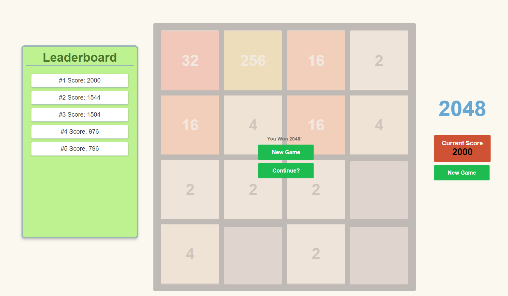

# The 2048 - GA Project 1

## About The Game

The objective of the 2048 game is to reach the tile with a value of 2048 by combining adjacent tiles of the same
value. The game is played on a 4x4 grid, where new tiles with a value of either 2 or 4 appear randomly after each
move. The player can move tiles in four directions (up, down, left, right), and with each move, all tiles slide as far
as possible in the chosen direction. If two tiles with the same value collide during a move, they merge into a
single tile with the combined value. The game continues until there are no empty cells left on the grid and no
possible moves can be made. The player's final score is the sum of all tile values on the grid when the game ends

```shell
.
└── css
│    └── style.css
├── image
├── src
│    └── script.js
├── index.html
└── README.md

```

# Screenshot



# Getting Started
Navigate through the captivating challenge of 2048 using your arrow keys to slide tiles across the grid. Merge tiles of the same value to double their number, with your sights set on the ultimate goal: creating a tile with the value of 2048. Achieving this coveted milestone declares you a winner, but the thrill doesn't end there. Push your limits and continue playing to surpass your highest score! Each move is a new opportunity to strategize and aim for a new personal best

Ready to slide, combine, and conquer?"

Link to play 2048!
https://bennfsx.github.io/GA-Project1/

# Technologies Used

- JavaScript
- HTML
- CSS

# Future Enhancement
- Custom theme
- Improving Design/UI
- Live database to store username and highscore
